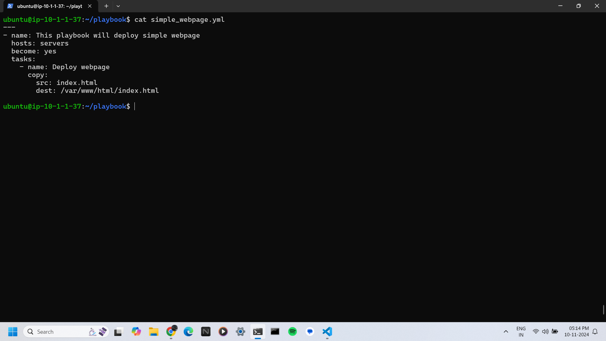
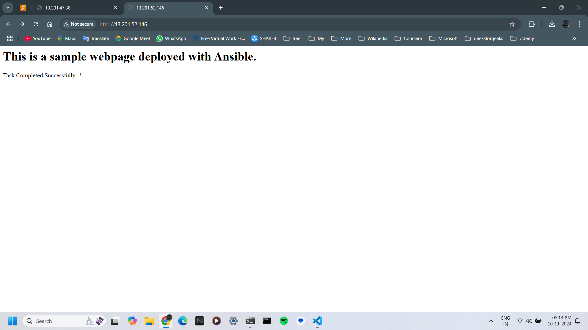

# Automated Web application Deployment using Ansible
Ansible is an open-source IT automation tool that can automate many IT tasks, including:
- Installing software
- Configuring systems
- Provisioning infrastructure
- Improving security and compliance
- Orchestrating complex workflows  

Ansible is written in Python and uses a human-readable language. It works by connecting to nodes and pushing out small programs called modules, which are resource models of the desired state of the system. Ansible then executes these modules and removes them when finished. Ansible is designed to be simple and easy to use, and it focuses on security and reliability. It's a valuable tool for developers and IT professionals, and can help save time and boost production.  

**In this project we are going to configure the web app servers and deploy the static web application.**  

> ### **Note**  
> Knowledge of `AWS EC2` and `ansible` required for completing this project. You can also use multimachine vagrant to complete this project locally.

## Let's get started...

## Task-01: Create 3 EC2 instances
Login to your AWS account and navigate to the EC2 section in the AWS cloud console. Click on `Launch instances` option on the upper right Create. Then create 3 instances with the same key pair (key name=ansible_key).  
<!-- <p align="center"></p> 


<p float="left">
  
   
  
</p>

 

<p align="center"></p>

-->

Click on `Launch instances`


Type name as `ansible_host` in Name option
 

Select AMI `Ubuntu` from AMI options


Choose `VPC` and `public subnet`  
**NOTE:** Choose Auto-assign public ip option


Click on `Create new key pair` option to create new key pair


Type `ansible_key` in key pair name option, leave other options to their default setting and click on create key pair. As I have already created key pair thats why you are seeing `key pair already exists` message.  
```Choose RSA as key pair type and .pem as private key file format if not selected by default```


Select key pair you just created `ansible_key`


Choose `create new security group` to create new sg for ansible_host and allow only ssh traffic


For storage option of the ec2 instance leave them as default. Now check all the parameters and if feel ok click `Launch instance`


You can see all of your running instances in the `instances` dashboard.  
After creating the 3 EC2 instances, name one instance as the ansible_host as it is our ansible control node, and the other two instances as ansible_server1 and ansible_server2 as they are ansible managed nodes.  


## Task-02: Connect to ansible_host EC2 instance and install ansible
Now connect to ansible_host EC2 instance  
steps to connect to the ansible_host  
  
command to connect to the ansible_host
```
ssh -i ~\Downloads\ansible_key.pem ubuntu@13.201.40.36
```  


check ansible_host information using below command (optional)  
```
hostnamectl
```  
<details>
<summary>Alternate commands to check the host info:</summary><b>

  - uname
  - uname -a
  - cat /etc/os-release

</b></details>  
  

Add the ansible PPA repository using the below command:
```
sudo apt-add-repository ppa:ansible/ansible
```


Update the package using following command
```
sudo apt update -y
```


Install ansible using the following command:
```
sudo apt install ansible -y
```  
  

After the installation you can check the ansible version using below command
```
ansible --version
```  
  

## Task-03: Copy private key file
Now copy the private ssh key from local host to ansible_host in the /home/ubuntu/.ssh directory.  
ansible_host private key file=  `ansible_key.pem`

Now come back to the windows powershell by typing `exit` or `logout` in the ansible_host EC2 instance terminal.  
Now use the below scp command to copy the private key file to the ansible_host node
```
scp -i path/to/ansible_key path/to/ansible_key ubuntu@public-ip:~/.ssh
```
OR  if you have key in downloads folder use below command
```
scp -i ~\Downloads\ansible_key ~\Downloads\ansible_key ubuntu@13.201.40.36:~/.ssh
```  


Now ssh into the ansible_host node, and navigate to the .ssh/ directory  
check the permissions of the ansible-key, if they are not `-r-------` or `400` then change the key permissions using below command  
**permissions before= -rw-rw-r-- or (664)**  

command to change permissions
```
sudo chmod 400 ~/.ssh/ansible_key.pem
```  
**permissions after= -r-------- or (400)**


## Task-04: Set hosts file
Now create the `hosts` file in the `/etc/ansible` directory because this is where we specify our servers and their ip address so that ansible can perform its tasks on the managed nodes.  

create hosts file
```
sudo nano /etc/ansible/hosts
```  
hosts file content-
```
[servers]
server1 ansible_host=13.233.194.13
server2 ansible_host=3.7.46.139

[all:vars]
ansible_python_interpreter=/usr/bin/python3
ansible_ssh_private_key_file=/home/ubuntu/.ssh/ansible_key.pem
```  


## Task-05: Run 1st ansible playbook  
Before running the ansible playbook you can check if the servers are reachable or not by using ping command  
```
ansible servers -m ping
```
  
It will show `SUCCESS` message if they are reachable.  

Now create a `playbook` directory and navigate to it  
command below
```
mkdir playbook && cd playbook
```
Now create and write a ansible playbook to install Nginx. ansible playbooks are written in `YAML` language, so you should know how to write using yaml language.
- file name= `nginx_install.yml`  
```yaml
---
- name: This playbook will install Nginx on server nodes
  hosts: servers
  become: yes
  tasks:
    - name: Update apt cache
      apt:
        update_cache: yes
    - name: Install nginx
      apt:
        name: nginx
        state: latest
    - name: start nginx
      service:
        name: nginx
        state: started
```  
In this playbook, we first specify the name of the playbook as `This playbook will install Nginx on server nodes` so it is also the description of the playbook file and the host/s we want to target i.e., `[servers]`. We also set `become: yes` to run the tasks with root privileges.  
The first task updates the apt cache on the managed/server nodes using the apt module. The second task installs the latest version of Nginx using the same module. The third task uses the service module to start the Nginx service by specifying the service name `nginx` and setting the state parameter to started.  

Now run playbook using below command
```
ansible-playbook install_nginx.yml
```  


Check the status of the Nginx on the two server instances using below command
```
ansible servers -a "sudo systemctl status nginx"
```  


### Now that you can see nginx is running on the two server instances.

## Task-06: Deploy simple webpage using ansible playbook
Now we will deploy a simple webpage using the ansible playbook.  
first write a simple HTML webpage.  
filename= `index.html`
```html
<html>
<body>
<h1>This is a sample webpage deployed with Ansible.</h1>
<p>Task Completed Successfully...!</p>
</body>
</html>
```


Now write a ansible script to deploy that webpage  
filename= `simple_webpage.yml`
```yaml
---
- name: This playbook will deploy simple webpage
  hosts: servers
  become: yes
  tasks:
    - name: Deploy webpage
      copy:
        src: index.html
        dest: /var/www/html/index.html
```

This playbook will take the index.html file from the ansible_host machnie and will copy it to the /var/www/html directory of the each server.

Now run the playbook using below command
```
ansible-playbook simple_webpage.yml
```
After the successful execution of the ansible playbook go to the EC2 dashboard and click on the server1, then in public IPv4 address option their is `open address` option in blue colour, click on it. You will see below output. Same for the other server server2.



## Well Done...!
## Task-07: Deploy a Health care web application
Now that you have deployed a simple webpage successfully, lets deploy a sample health care static web application using ansible and shell scripting.  
First now lets create a shell script file that will perform tasks on the server nodes.  
file name= `deploy_webapp.sh`  
sample webpage source= `https://www.tooplate.com`  
Shell script will download the specific health care web application zip file from this website to each server node to unzip and deploy it.

```sh
#!/bin/bash

# Update the packages
#sudo apt update -y

# Install necessary packages (curl, unzip)
sudo apt update -y ; sudo apt install curl unzip -y

# check nginx status
#status=`sudo systemctl status nginx | grep Active | awk '{print $2}'`

cd

# Download the web content in the temp directory
curl https://www.tooplate.com/zip-templates/2098_health.zip -o 2098_health.zip

# Unzip the zipped file
unzip 2098_health.zip

# copy web content into the /var/www/html directory
sudo cp -r ~/2098_health/* /var/www/html

# remove the tmp directory
sudo rm -rf ~/2098_heal*
```

Now lets write a ansible playbook to copy this shell scirpt to each server node to deploy web application.  
file name= `deploy_webapp.yml`

```yaml
---
- name: Deploy Static Web App
  hosts: servers
  become: yes

  tasks:
    - name: Copy script to remote server
      copy:
        src: ./deploy_webapp.sh
        dest: /tmp/deploy_webapp.sh
        mode: 0755

    - name: Execute the script
      shell: /tmp/deploy_webapp.sh

    - name: Remove the script
      file:
        path: /tmp/deploy_webapp.sh
        state: absent
```

Now run the ansible playbook using below command  
```
ansible-playbook deploy_webapp.yml
```
If the command executed successfully you will see the output like below  


Now that our health care web application has been deployed successfully, you can access it using the public ip of the two servers or click on open address option in the AWS instances dashboard.  
You will see that our health care web application has been deployed succesfully.

**OUTPUT** 


# Congratulations 🎉🎉 You have successfully deployed a sample health care web application.

